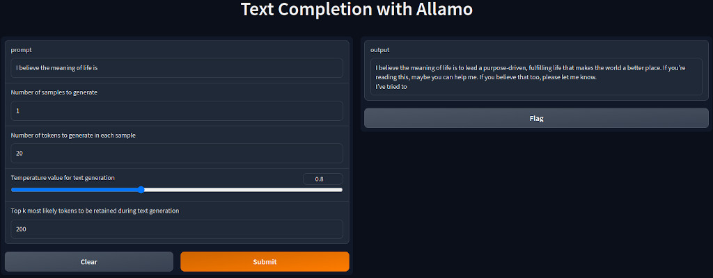

# ALLaMo

<p align="center">
  
</p>

This repository is intended as a simple, hackable and fast implementation for training/finetuning/inference [LLaMA](https://ai.facebook.com/blog/large-language-model-llama-meta-ai/)-based models ([arXiv](https://arxiv.org/abs/2302.13971v1)).

## Install

Dependencies:

- Python 3
- [pytorch](https://pytorch.org)
- [numpy](https://numpy.org/install/)
- [tiktoken](https://github.com/openai/tiktoken)
- [huggingface transformers](https://huggingface.co/docs/transformers/installation)
- [gradio](https://www.gradio.app/)

## Datasets

Before you start training a new model, you need to create train and test datasets. The script `train.py` expects 2 files: `train.bin` and `val.bin`. You can create the both files using `prepare_datasets.py` or implementing a simple script like this:

```
import numpy as np
import tiktoken

def encode_file(input_file_path, output_file_path, tokenizer_name):
    tokenizer = tiktoken.get_encoding(tokenizer_name)
    with open(input_file_path, 'r') as f:
        data = f.read()
    enc_data = tokenizer.encode(data)
    enc_data = np.array(enc_data, dtype=np.uint32)
    enc_data.tofile(output_file_path)
    
encode_file('raw/dataset1/train.txt', 'data/dataset1/train.bin', 'cl100k_base')  
```

## Training

Use the script `train.py` to start your training. It reads a `train.bin` and `val.bin` files from the dataset directory. 

The training script can be run on both a single node with one or more GPUs, as well as on multiple nodes with Distributed Data Parallel (DDP).

To run on a single node with 1 GPU, example:

```
$ python train.py \
    --config="../config/train_allamo_cl100k_base.json" \
    --wandb_log=True
```

To run on a single node with 8 GPU with DDP, example:

```
$ torchrun --standalone --nproc_per_node=8 train.py \
    --config="../config/train_allamo_cl100k_base.json" \
    --wandb_log=True
```

To run on 2+ nodes with DDP, example:
- Run on the first (master) node with example IP 123.456.123.456:

```
$ torchrun --nproc_per_node=8 --nnodes=2 --node_rank=0 --master_addr=123.456.123.456 --master_port=1234 train.py \
    --config="../config/train_allamo_cl100k_base.json" \
    --wandb_log=True
```

- Run on the worker node(s):

```
$ torchrun --nproc_per_node=8 --nnodes=2 --node_rank=1 --master_addr=123.456.123.456 --master_port=1234 train.py \
    --config="../config/train_allamo_cl100k_base.json" \
    --wandb_log=True
```

Note: in case your cluster does not have Infiniband interconnect prepend `NCCL_IB_DISABLE=1`.

## Finetuning

The process of finetuning is similar to regular training, but we initialize from a pretrained model and use a smaller learning rate during training. In addition, it is essential to ensure that the model parameters used for finetuning are consistent with those used during pre-training.

## Import LLaMA models

Use the script `import_llama_weights.py` to import LLaMA model weights and tokenizer, and create a checkpoint for further finetuning. In order to obtain the weights, fill this [google form](https://forms.gle/jk851eBVbX1m5TAv5). Example script execution:

```
python import_llama_weights.py \
    --input_data_dir="../llama/7B/" \
    --input_tokenizer_path="../llama/tokenizer.model" \
    --output_data_dir="../data/llama-7b/"
```

Notes: 

1. the import process of the 7B LLaMA model takes ~14GB of RAM and generates 13.5GB output files.
2. the script doesn't support sharded models.
3. the LLaMA tokenizer is loaded using [HuggingFace Transformers](https://huggingface.co/docs/transformers/). Check if your installed version supports `LlamaTokenizer`.

## Sampling / Inference

Use the script `sample.py` to sample from a model you trained. For example:

```
$ python sample.py \
    --config="../config/train_allamo_cl100k_base.json" \
    --max_new_tokens=100 \
    --temperature=0.7 \
    --top_k=200 \
    --num_samples=5 \
    --prompt="Long long time ago"
```

You can also prompt the model with some text from a file prefixing its path with `FILE:`, example:

```
$ python sample.py \
    --config="../config/train_allamo_cl100k_base.json" \
    --max_new_tokens=100 \
    --temperature=0.7 \
    --top_k=200 \
    --num_samples=5 \
    --prompt="FILE:prompt.txt"
```

Specify the tokenizer using `--tiktoken_tokenizer_name` for Tiktoken (e.g. `cl100k_base`), or thanks to HuggingFace Transformers, you can easily use your own pretrained tokenizer using `--custom_tokenizer_path` to provide your tokenizer's JSON config file.

Use the script 'sample_api.py' to expose 3 API endpoints. Then you will be able to query a pretrained model for text embeddings and completions. 

To run the API with a pretrained model, example:

```
$ python sample_api.py \
    --config="../config/train_allamo_cl100k_base.json" \
    --max_new_tokens=10 \
    --temperature=0.7 \
    --top_k=200 \
    --num_samples=5
```

- Query for text embeddings, example:

```
$ curl -X POST -H "Content-Type: application/json" http://localhost:5000/embeddings -d '{"prompt": "Long long time ago"}'
```

- Query for text completions, example:

```
$ curl -X POST -H "Content-Type: application/json" http://localhost:5000/completions -d '{"prompt": "Long long time ago", "num_samples": 3}'
```

- Query for tokens to see how your prompt is tokenized, example:

```
$ curl -X POST -H "Content-Type: application/json" http://localhost:5000/tokens -d '{"prompt": "Long long time ago"}'
```

To run the UI at top of the API, example:

```
$ python sample_u.py
```

## Running LLaMA 7B on CPU



You can reach a point where you intend to run an LLaMA model, but your GPU does not have sufficient memory, and you encounter the OOM error. The easiest and quickest way to handle, or rather work around, this issue is to run the model on the CPU using your RAM. You can easily do this by specifying the device in the arguments. Here is an example:

```
$ python sample_api.py \
    --checkpoint_path="../data/llama-7b/import_ckpt.pt" \
    --llama_tokenizer_path="../data/llama-7b/" \
    --device=cpu
```

Note: in order to run the 7B model, you will need ~14GB of RAM.

## Efficiency

With [PyTorch 2.0](https://pytorch.org/get-started/pytorch-2.0/) and `torch.compile()`, you can see significant speedup. Using the fused AdamW optimizer and `compile()`, my training ran 30% faster than without these two modes enabled.

## Citation

Please cite this repo if you use it.
```
@misc{allamo,
  author = {Krzysztof Ociepa},
  title = {ALLaMo: Simple, hackable and fast implementation for medium-sized LLaMA-based models},
  year = {2023},
  publisher = {GitHub},
  journal = {GitHub repository},
  howpublished = {\url{https://github.com/chrisociepa/allamo}},
}
```

## References:

1. [nanoGPT](https://github.com/karpathy/nanoGPT) - many thanks to Andrej Karpathy for amazing and inspirational work!
2. [LLaMA](https://github.com/facebookresearch/llama)
